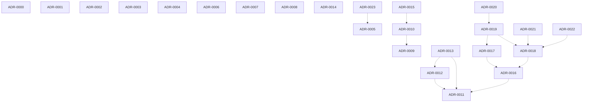

# ADR lineage

> **Regenerated by the `link-adr-graph` skill.** Body wholly rewritten on every run; hand-edits are blown away. No timestamps in the body — byte-stable across runs given the same ADR set. See `docs/log.md` (`adr | regenerated lineage`) for when.

## Graph

Solid arrow = supersedes; dashed arrow = amends. Superseded ADRs are marked.

## Lineage table

| id | title | status | supersedes | amends | superseded_by |
|----|-------|--------|------------|--------|---------------|
| ADR-0000 | Record architectural decisions as ADRs | Accepted | — | — | — |
| ADR-0001 | Crux is the sole AI development workflow | Accepted | — | — | — |
| ADR-0002 | Simplicity first: the least complex design that meets current requirements | Accepted | — | — | — |
| ADR-0003 | Keep package boundaries narrow with one public entrypoint per runtime surface | Accepted | — | — | — |
| ADR-0004 | Build products as verticals inside a modular-monolith platform shell | Proposed | — | — | — |
| ADR-0005 | Isolate tenants in one PostgreSQL cluster with owned schemas and forced row-level security | Proposed | — | — | — |
| ADR-0006 | Keep login identities separate from connected provider accounts | Proposed | — | — | — |
| ADR-0007 | Route AI work through AiExecutionGateway profiles and run agents only in the isolated worker | Proposed | — | — | — |
| ADR-0008 | Interview answers are structured guides that render their Markdown | Accepted | — | — | — |
| ADR-0009 | Keep candidate documents in the Interview product | Accepted | — | — | — |
| ADR-0010 | Write documents in a few parallel calls on any language profile | Accepted | — | ADR-0009 | — |
| ADR-0011 | Host the Active Session processor in the agent worker behind a versioned wire contract | Accepted | — | — | — |
| ADR-0012 | Keep Active Session data private to the actor and enforce locality before dispatch | Accepted | — | ADR-0011 | — |
| ADR-0013 | Pause rather than end an Active Session on credential expiry or companion stop | Accepted | — | ADR-0011, ADR-0012 | — |
| ADR-0014 | Use worker-owned agent sessions with one terminal outcome | Accepted | — | — | — |
| ADR-0015 | Validate owned document batches and measure grouping | Proposed | — | ADR-0010 | — |
| ADR-0016 | Run Active Session assistance on the worker executor with screenshots and two action slots | Accepted | — | ADR-0011 | — |
| ADR-0017 | Host the Active Session overlay as one route and isolate providers without emptying their home | Accepted | — | ADR-0016 | — |
| ADR-0018 | Capture on demand with masks and owner-requested companion captures | Accepted | — | ADR-0016 | — |
| ADR-0019 | Host the overlay in a native shell through one host adapter | Accepted | — | ADR-0017, ADR-0018 | — |
| ADR-0020 | Sign in to Studio from the native shell through a one-time handoff | Proposed | — | ADR-0019 | — |
| ADR-0021 | Negotiate companion capture requests and report their failures | Proposed | — | ADR-0018 | — |
| ADR-0022 | Allow owner-enabled hands-free listening and automatic capture | Proposed | — | ADR-0018 | — |
| ADR-0023 | Use the query builder by default and check the database role on every tenant-scoped path | Proposed | — | ADR-0005 | — |

## Topic clusters

ADRs grouped by shared tag (a tag appears below if ≥2 ADRs carry it). Use a cluster to find the current decision on a topic.

- **active-session** — ADR-0011, ADR-0012, ADR-0013, ADR-0016, ADR-0017, ADR-0018, ADR-0019, ADR-0020, ADR-0021, ADR-0022
- **agents** — ADR-0001, ADR-0007, ADR-0010, ADR-0014, ADR-0016, ADR-0017
- **ai** — ADR-0007, ADR-0009, ADR-0010, ADR-0014
- **architecture** — ADR-0002, ADR-0004
- **capture** — ADR-0018, ADR-0021, ADR-0022
- **companion** — ADR-0018, ADR-0021
- **contracts** — ADR-0008, ADR-0011
- **documents** — ADR-0009, ADR-0010, ADR-0015
- **drizzle** — ADR-0005, ADR-0023
- **interview** — ADR-0008, ADR-0009, ADR-0010, ADR-0011, ADR-0012, ADR-0013, ADR-0015
- **native** — ADR-0019, ADR-0020
- **oauth** — ADR-0006, ADR-0020
- **overlay** — ADR-0017, ADR-0018, ADR-0019, ADR-0022
- **performance** — ADR-0010, ADR-0015
- **postgresql** — ADR-0005, ADR-0023
- **privacy** — ADR-0007, ADR-0009, ADR-0011, ADR-0012, ADR-0013, ADR-0018, ADR-0019, ADR-0020, ADR-0022
- **process** — ADR-0000, ADR-0001
- **security** — ADR-0005, ADR-0006, ADR-0023
- **tenancy** — ADR-0005, ADR-0023
