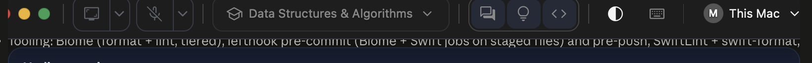

# Native app QA: todo and issue log (2026-10-07)

Found by driving the installed `~/Applications/Interview Studio.app` (build `ebd583b+`) on the real macOS window.
Each issue has repro steps, a screenshot, status and the fix. Screenshots live in `native-qa/`.

## Todo (work through in order)

- [ ] 001 Toolbar close dot clipped (window does not re-fit when the toolbar grows)
- [x] 002 Footer build tag shows "dev" in Docker-served builds
- [ ] 003 Window-dot hover glyphs (x, minus, plus) are off-centre inside the dots
- [ ] 004 Window size/position jumps between clicks (800 to 904 to 760 wide; y moved 297 to 152)
- [ ] 005 Toolbar menus do not open before a session (owner: expected, controls should be inert/disabled then; retest menus inside a session)
- [ ] 007 See-through toggles on with NO session (owner: it must be disabled without a session)
- [ ] 006 See-through ON: start text overlaps the text behind the window (legibility)
- [x] 008 Footer is cropped at the window's bottom edge (no bottom border or rounded corners, flush to the edge)
- [ ] 009 Window height not restored after Pause/Resume (640 before pause, 545 after; low)
- [x] Pause / Resume (works: timer excludes paused time, panes hide and return)
- [x] 010 Session pauses itself a few seconds after start/resume (FIXED, see below)
- [ ] 011 Second screenshot apply ("Add to T1") fails: "That didn't go through. Nothing changed; try again." (first capture + apply worked)
- [ ] Drag from an empty part of the toolbar and of the footer; buttons still press
- [ ] I-beam cursor over transcript, answer, code, notes; selecting does not move the window
- [ ] Every toolbar menu opens, is clickable, closes with Esc (capture, mic, answer style, shortcuts, green dot)
- [ ] End confirmation appears above the panels; both buttons work
- [ ] See-through at 100 / 60 / 22
- [ ] Window modes (Normal / Mini / Full) and quit confirmation
- [ ] Settings window; sign-in and start flow

## 001 Toolbar close dot clipped

**Issue.** With the toolbar plus the "This Mac" account chip, the toolbar is wider than the 800 px window, so the red close dot at its left edge is cut off.

**Steps to repro.**
1. Launch `~/Applications/Interview Studio.app`.
2. Sign in "on this Mac" and let the toolbar show the account chip (window 800 x 640 at 688,318).
3. Look at the left end of the toolbar.

**Expected.** The window is at least as wide as the toolbar plus padding, so every control is visible.
**Actual.** The close dot is clipped at the window's left edge.

**Screenshot.** 

**Suspected cause.** `panels/single-panel.tsx` (window-fit effect) observes `root.children` with a `ResizeObserver`. The toolbar sits in a `display: contents` wrapper (`toolbar.tsx`, `data-drag-handle` / `pn-contents`), which has no box, so the observer never fires when the toolbar grows and the width is not re-requested.

**Plan.** Add a real-browser test (host shim `setWindowSize`) that widens the toolbar and expects a new, wider request; confirm it fails; observe the wrapper's first element child instead; re-run; rebuild and reinstall; re-check the real window.

**Status.** Open.

## 002 Footer build tag shows "dev" in Docker builds

**Issue.** The footer build tag reads "dev" in builds served from Docker (the image has no git to read the commit from).
**Steps to repro.** `pnpm app:up`, open the app, read the footer tag.
**Screenshot.** Not yet captured.
**Severity.** Low (cosmetic, but it hides which build is running).
**Status.** Open.

## 003 Window-dot hover glyphs off-centre

**Issue.** On hover the red / amber / green dots show their glyphs (x, minus, plus), but each glyph sits low and left of the dot's centre.
**Steps to repro.** Launch the app, hover the dot group at the toolbar's left end.
**Expected.** Each glyph is centred in its dot.
**Screenshot.** Supplied by the owner in chat (hover state, dots at the toolbar's left end); capture my own in the next pass.
**Status.** Open (owner: fix after the walkthrough).

## 004 Window size and position change between clicks

**Issue.** Plain clicks on toolbar controls were followed by the window changing size and position (800x640 at 688,318, then 904x640 at 476,297, then 760x640 at 445,152). The shell re-fits about the window's centre; the first fit only happens after the first re-render, and y also moved.
**Steps to repro.** Launch, note the window bounds (System Events), click a toolbar caret, read the bounds again.
**Screenshots.** `native-qa/001b-window-refit-only-after-interaction.png` (after the first re-fit).
**Status.** Open; related to 001, cause not yet isolated (y movement is unexplained).

## 005 Toolbar menus do not open on synthetic clicks

**Issue.** Clicking the capture caret (three times, with longer hover dwell) and the keyboard-shortcuts button opened nothing. The See-through toggle responds to the same clicks (on, then off).
**Steps to repro.** Launch; send a mouse move, then down/up (CGEvent) to the caret at window point (213, 25).
**Screenshot.** `native-qa/005-toolbar-menus-do-not-open.png`.
**Open question.** Real mouse versus synthetic events: the app may open menus on a pointer event the synthetic click does not produce. Owner to try one real click on the capture caret.
**Status.** Unconfirmed.

## 006 See-through ON: start text overlaps the content behind

**Issue.** With See-through on, "Start a session for", the permission rows and the buttons draw over the text of the app behind, so both are hard to read.
**Screenshot.** `native-qa/006-see-through-text-overlap.png`.
**Status.** Open (may be the intended glass look; owner to judge).

## 005 update (owner, 2026-10-07)
Menus not opening with no session is expected. The controls should look disabled then (they currently look enabled). Retest every menu inside a live session.

## 007 See-through is enabled with no session

**Issue.** The See-through toggle works (panel goes glass, page behind shows through) while no session exists. Owner: it should be disabled without a session, like the other session controls.
**Steps to repro.** Launch with no session, click the half-circle toolbar button.
**Screenshot.** `native-qa/006-see-through-text-overlap.png` (the glass state with no session).
**Status.** Open.

## 008 Footer cropped at the bottom of the window

**Issue.** The footer row runs flush to the window's bottom edge: its bottom border and rounded corners are cut off, while the panels above keep theirs. Seen with no session and in a running session. At launch the footer was also partly behind the Dock (window 800x640 at y=318).
**Steps to repro.** Launch the app (no session) and look at the bottom edge; start a Rehearsal session and look again.
**Expected.** The footer keeps its full rounded outline with the window padding below it.
**Screenshots.** `native-qa/008b-footer-cropped-no-session.png`, `native-qa/008-footer-cropped-in-session.png`.
**Suspected cause (unverified).** The window height from `single-panel.tsx` (`WINDOW_PAD` / `WINDOW_GAP` sums) leaves no room below the footer.
**Status.** Open. Owner to confirm this is the cropping meant.

## 009 Window height after Pause then Resume

**Issue.** Before Pause the window was 1262x640; while paused 760x144; after Resume 1262x545. The pane row lost ~95 px.
**Steps to repro.** Start a session, Pause, Resume; read the window bounds each time.
**Screenshot.** `native-qa/009-height-after-resume.png`.
**Severity.** Low. **Status.** Open.

## Fixed so far (2026-10-07)
- 002: with `pnpm app:dev` (host `next dev` behind the native shell) the tag reads the real commit. Docker image still has no git; left as is.
- 008: `.pn-root` native padding 8px (half `WINDOW_PAD`), browser test `window-fit.spec.ts` ("keeps a margin"). Verified in the live window.

## 010 Session pauses itself a few seconds after start or resume (FIXED)

**Issue.** Start or Resume, the mic shows listening, and ~6 s later the session is Paused with no reason shown (owner's report: "starts and then stops without any idea of why").
**Trace (real app, 2026-10-07).** Companion heartbeat 5 s after start: `capturing=false state=sourceLost sources={microphone: running, applicationAudio: lost}`; server paused the session as `companion-stop`. The application-audio recogniser task ended with `kAFAssistantErrorDomain 1110 "No speech detected"` (silence), the transcriber treated that as a failure and marked the source lost, and a lost source outranked the still-running microphone.
**Fixes.**
1. `apps/capture-companion/macos/Sources/CaptureAdapters/OnDeviceSpeech.swift`: 1110 is silence, not failure; the request is dropped and the next audio opens a new one (`isSilenceEnd`).
2. `CaptureCore/CompanionState.swift`: `isCapturing` is true while any selected source is running; a lost source is a visible problem (state stays `sourceLost`) but no longer stops the session. A revoked permission, a failed capability, Studio's pause and terminal states still stop everything. Test: PolicyTests "a lost source stops only itself".
3. Observability so this is never silent again: `CaptureCore.CompanionEvents` (one hook) → `StudioShellCore.EventLog` (one entrypoint; origins user/page/heartbeat/server/system; unified log + rotating JSONL at `~/Library/Logs/Interview Studio/events.jsonl`; `STUDIO_LOG_LEVEL`, `STUDIO_EVENT_LOG*`); heartbeat carries `diagnostics` (codes only); server logs `companion.heartbeat_stop` with them through the new `@omnitech/logging` (`LOG_LEVEL`, `LOG_FORMAT`, `LOG_CONTENT`), which also reports every AI gateway call (`ai.execute`, `ai.stream`; content only at trace with `LOG_CONTENT=true`).
**Verified.** Rebuilt app: after Resume the session stayed `active` 15 s+, heartbeats `capturing=true state=listening`, both sources running; the mic recovered after a silence. Tests: capture-core 71, studio-shell 170, logging + ai-runtime 61, contracts 32.

## 001 update
Not fixed yet. A real-browser test exists (`e2e/live-session/tests/window-fit.spec.ts`, `test.fixme`): the toolbar grows to 1100 px, a ResizeObserver on it fires, yet no wider `setWindowSize` is recorded. The mapping of the `display: contents` wrapper to its first child and observing the toolbar directly did not change the result, so the cause is elsewhere (suspect: the request path in `native-adapter.ts` / the fit effect's closure). Next step: log inside `fit()` in a dev build (production builds strip console output, which is why the earlier probe was silent).

## 011 Adding a second screenshot to a task does not go through

**Issue.** Capture a screenshot, apply it (works: T1 is created and answered). Capture another, choose "Add to T1", press Retry/apply: the panel says "That didn't go through. Nothing changed; try again." every time.
**Steps to repro.** Start a session; Capture screenshot; Apply (New problem). Capture screenshot again; keep "Add to T1"; Apply.
**Screenshot.** Owner's, 2026-10-07 12:14 (dock "To apply · 1", message under the radio buttons).
**Status.** Open; server-side cause being read from the dev log.
