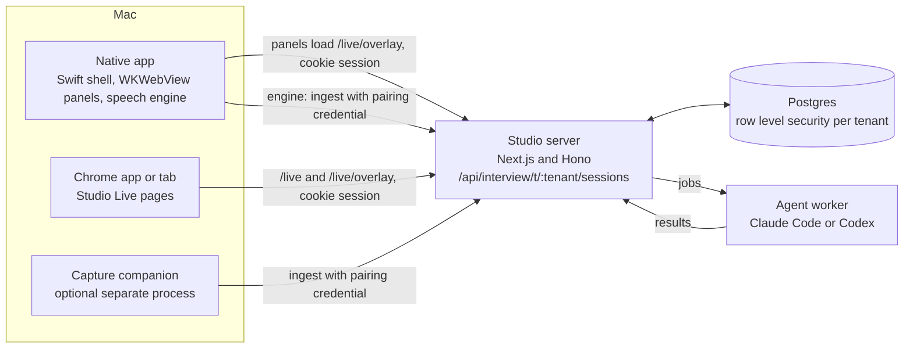
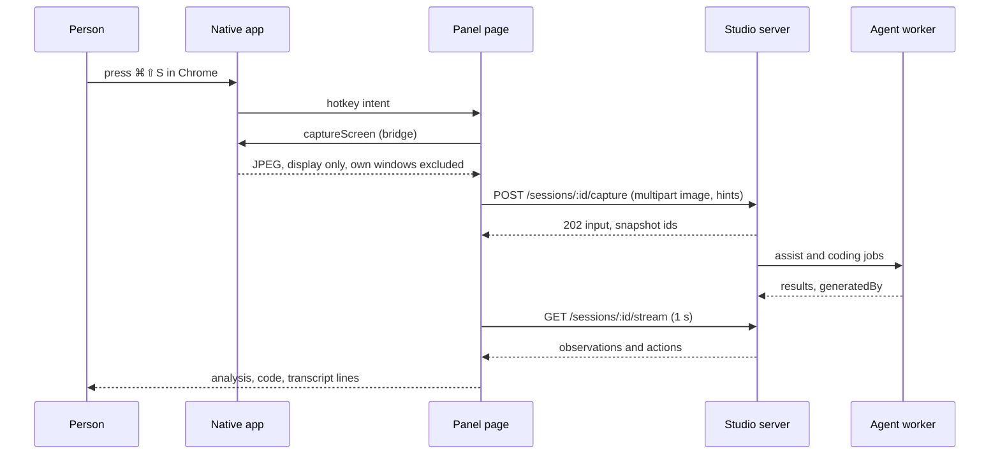
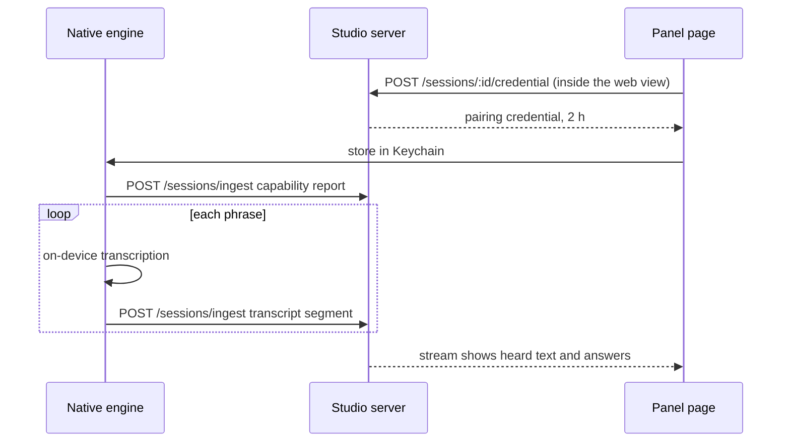
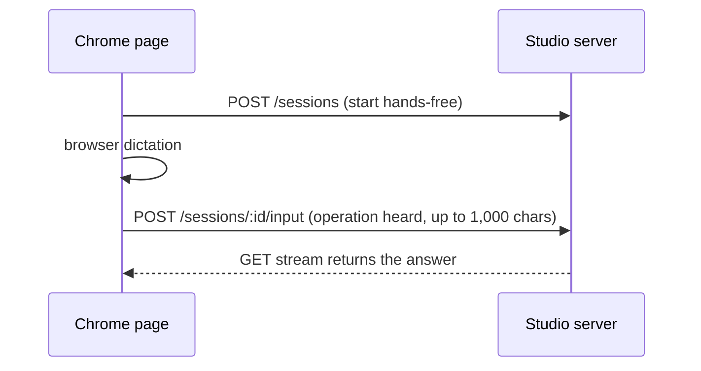
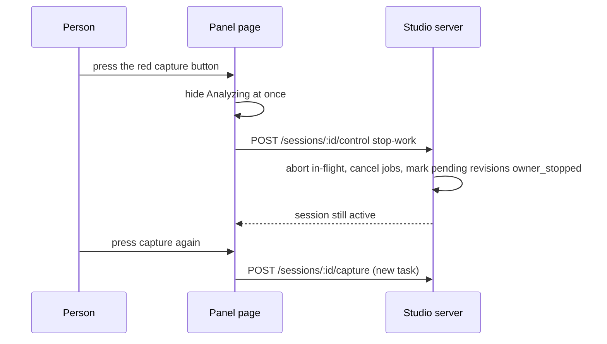
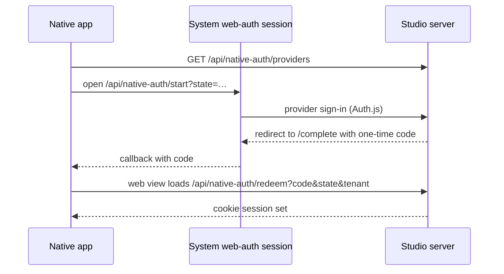

# Interview Studio: feature matrix

Branch `feat/active-session`, 2026-10-04. Covers the native macOS app, the Chrome app and web live-session pages, how they integrate, and every API call between them and the server. Facts come from the code; where a reason is not written down in an ADR or a comment it is marked *inferred*. "Business case" is the value hypothesis for the feature, not a measured result.

How to read the tables: each feature has **Why it exists**, **How it works**, **Business case** and **Calls** (the bridge methods or HTTP endpoints it uses; section 5 has the full API catalogue).

## 1. The system at a glance

| Piece | What it is | Who owns the truth |
|---|---|---|
| Studio server | The brain: stores the session, runs the assist and coding stages, checks claims, fences results | The server. Every surface below only presents or feeds it |
| Native app | A thin macOS host: floating panels, global hotkeys, screen capture, on-device speech | Holds no session state; the session lives on the server |
| Chrome app / web pages | The full Studio UI: setup, live view, history, plus a compact card | Same server session as the native app, so both stay in sync |
| Capture companion | A separate process that can hear app audio and post it to the server | Optional now that the native app embeds the same engine |
| Agent worker | Runs Claude Code or Codex jobs for the server | Never reachable from the browser or the native app |

## 2. Native app (Interview Studio.app)

### 2.1 Windows and layout

| Feature | Why it exists | How it works | Business case | Calls |
|---|---|---|---|---|
| One-window view (default) | The owner asked for "one panel I can expand and move around"; the four-panel layout was cumbersome. ADR-0019 makes the native shell a host adapter of one Presentation interface | A single translucent NSPanel loads `/t/:tenant/p/interview/live/overlay?host=native&panel=single&handsfree=1`. Layout preference `shell.layout4`, default compact | One glanceable surface during a live interview, fewer windows to manage | Page load; session API (section 5) |
| Pane toggles and window pivot | Show only what is needed without the toolbar moving | Panes are a table (`PANES` in `toolbar-config.ts`: chat 320, analysis 480, code 420 px). The page calls `studioHost.presentation.setWindowSize({width, height?})`; the shell widens or narrows the window about its centre, never narrower than the toolbar. With no pane showing, the height fits the toolbar and footer | Screen space is scarce next to an interview page | Bridge: `presentation.setWindowSize` |
| Four-panel layout | Reproduces the reference product (OpenCluely) layout from the recorded video: bar, analysis, chat, settings (`bionic/inbox/opencluely-video-spec.md`) | Separate panels at `?panel=pill\|analysis\|chat\|settings`; reachable from the menu-bar item or Reset layout | Familiar layout for users coming from that tool | Page loads; bridge `presentation.open/close/setLayout` |
| Main Studio window | Full Studio (setup, history, deep review) inside the same app. Green button or ⌥⇧M | A normal NSWindow loading `/t/:tenant/p/interview/live` | One app instead of app plus browser tab | Page load |
| Menu-bar status item | Control without a visible window (layouts, opacity, show/hide, quit) | `StatusMenu.swift` drives the PresentationController | Recoverability when panels are hidden | None |
| Translucent, always-on-top panels | Stay readable over the interview page without blocking it | NSPanel with clear web view, flat tint (`--ov-a` 0.5), all Spaces and full-screen auxiliary; no blur layer | Glance at help while the page stays usable | None |
| Drag and resize | Reposition anywhere | A native overlay over the toolbar moves the window on drag and passes plain clicks to the page; the top strip and every edge and corner resize | Obvious, native-feeling control | None |
| Interaction mode (⌘⇧I) | Click-through when off so the page underneath stays usable, clickable when on | `panel.ignoresMouseEvents`; toast "Interaction Mode: ON/OFF" | Use the interview page and the helper at the same time | None |
| Toasts | Feedback for hotkeys (interaction, recording, skill) | Native `ToastPresenter`, large white text bottom-left, click-through | Confirms an action without focus change | None |

### 2.2 Toolbar and session controls

| Feature | Why it exists | How it works | Business case | Calls |
|---|---|---|---|---|
| Capture split button (⌘⇧S) with Auto or Manual menu | One control to capture, with the choice of re-analysing automatically or only on demand | `PillPanel` renders `[capture ⌘⇧S \| Auto ▾]`; the menu options are the `CAPTURE_MODES` table. Press runs `grabAndAnalyze`: host `captureScreen` returns a JPEG, then upload. The choice is remembered per tenant | Manual keeps the first analysis even when the screen changes; Auto removes a click | Bridge `captureScreen`; `POST /sessions/:id/capture` |
| Stop analysis | Pressing capture while work runs should stop it, and a second press starts a fresh task | While `phase` is set the button turns red; press sends control `stop-work` | Cancels wasted model time and cost without ending the session | `POST /sessions/:id/control {action: "stop-work"}` |
| Microphone toggle (⌥R) | Hands-free hearing on or off | Toggles the native engine's listening | Capturing questions without typing | Engine; ingest (section 2.5) |
| Skill selector (⌘↑ / ⌘↓ in interaction mode, or Settings) | The skill changes the style of every answer (DSA, System Design, Behavioral and others) | Stored in shell prefs and sent as hints with captures and follow-ups | Right answer style per interview type | Hints in `/capture` and `/input` |
| Model chip ("Claude · sonnet") | Transparency about which AI produced the answer | Latest succeeded action's `generatedBy` (runtime, model) read from the stream; display only, nothing branches on it | Trust, audit and cost visibility | `GET /sessions/:id/stream` |
| Status dot on the capture icon | Green = interaction on, red = off or recording | `pillTone()` | At-a-glance state | None |
| Bottom bar | Honest visibility note, build id, session controls, live status | Footer: "Visible window · shows in screen shares" (ADR-0018), build id, **Pause session / Resume session** (green), **End session** (red, with confirmation), **Start a new session** after an end. A status row shows the phase and a timer | Clear difference: Pause is a break and the session stays open; End finishes it; the capture button only stops the current analysis | `POST /control` pause, resume, end; `POST /sessions` |
| Phase wording | Say what is really happening | Table `phaseLabel`: Capturing the screen, Analyzing, Reading the problem, Drafting an answer, Solutioning (coding problem detected) | Fewer "is it stuck?" moments | None |

### 2.3 Content panes

| Feature | Why it exists | How it works | Business case | Calls |
|---|---|---|---|---|
| Chat transcript | Video spec: heard speech (green), assistant replies (purple), system lines, interim line | `panelRows()` merges server transcript, typed lines, assistant answers and stage lines (Analyzing…, Finished · 74s). Follows the newest line; scrolling up pauses following and shows a **Latest** button with a count | Read live without hunting for the newest item | `GET /stream` |
| Click an answer | Look back at an earlier answer without stopping the current one | Choosing a row pins that task in the analysis and code panes; a new task takes the view back. Nothing is cancelled | Compare problems during a session | None (view state) |
| Typed context | A screenshot alone may miss constraints | The input becomes a follow-up on the current task; placeholder "Add context for this problem, or ask a follow-up…" | Better answers from fuller context | `POST /input` (follow-up) |
| Analysis pane | The problem's name with a type pill, constraints chips, approach steps, complexity | `analysisView()`; name taken from the answer (quoted or after "LeetCode N,") else the restatement | Scannable answer at the right moment | `GET /stream` |
| Code pane | A real, highlighted, copyable solution | CodeMirror-based `CodeCard`; language header | Faster to reuse a clean solution | `GET /stream` |
| Auto mode | Re-analyse when a new screen appears, without pressing anything | While the analysis pane shows and Auto is chosen, the shell samples a 9×8 grey grid on this Mac (identical frames never leave it). A frame is analysed only if it is the first or at least 4 of 64 cells changed; default every 8 s (3 to 30 s); at least 15 s between automatic analyses; at most 120 per session; a failed capture is not charged. An optional 60 s heartbeat (off by default) re-analyses an unchanged screen | Hands-free with bounded cost | Bridge `screenWatch`; `POST /capture` |

### 2.4 Capture, privacy and permissions

| Feature | Why it exists | How it works | Business case | Calls |
|---|---|---|---|---|
| Whole-display capture | OpenCluely captures the whole desktop; the owner asked for the same | ScreenCaptureKit; the shell's own windows are excluded; longest edge capped at 1568 px; JPEG within the 2 MiB server limit | Matches the reference behaviour | Bridge `captureScreen` |
| Browser-only gate | The owner wants captures only while a browser is in front | `BrowserFocus` allows Chrome, Chrome Beta or Canary, Safari, Safari Technology Preview and Chrome-installed apps, decided from the frontmost app's bundle id before any pixel is read; both ⌘⇧S and Auto are gated | Limits exposure of anything outside the interview page | None |
| Screen Recording permission | macOS requires it | Preflight and a single request per launch; a plain note explains how to enable it. A wrapper avoids a SIGBUS crash in the system's async API | No silent failures | None |
| Microphone and speech permissions | Needed for hearing | macOS prompts once; the web view's own media prompt is answered by the shell for the Studio origin only | Fewer prompts | None |
| First-run consent | Nothing starts before the owner agrees | Native alert; the page sees the flag `studio.shell.consented` only afterwards | Consent captured before any recording | None |
| What it does not do | Policy | No hiding from screen share, no app disguise (ADR-0018); never types, submits or scrolls for the user; no content logging | Credibility with interviewers and compliance | None |

### 2.5 Hands-free engine and sign-in

| Feature | Why it exists | How it works | Business case | Calls |
|---|---|---|---|---|
| Native speech engine | The browser cannot hear the app's audio; ADR-0021 and ADR-0022 make the native app self-sufficient | `EngineSources` captures microphone and application audio; on-device transcription (Speech framework, no network fallback); a `CompanionSession` posts transcript segments, heartbeats and a capability report | Hears both sides of the call without installing the separate companion | `POST /sessions/ingest` |
| Pairing credential lifecycle | Authenticate the engine safely | Issued by calling the owner route inside the signed-in web view (private content world); stored in the Keychain; renewed 20 minutes before the 2 h cap; revoked on stop | The credential never touches page scripts or logs | `POST /sessions/:id/credential`, `DELETE` |
| Native sign-in handoff | The privileged web view must never show provider sign-in pages (ADR-0020, Proposed) | System web-auth session opens `/api/native-auth/start`; provider sign-in happens in that session; a one-time code returns; the web view loads `/redeem` | Sign in once, no passwords in the app | `GET /api/native-auth/providers, /start, /complete, /redeem` |
| Auto-start session | "Do as little as possible" | The first panel document starts a permitted-remote session with mic, app audio and screen under a Web Lock; others adopt it; a lost race adopts the running session | Zero-click start | `POST /sessions`, `GET /sessions` |
| Origin pinning and bridge trust | Security | Navigation stays on the Studio origin; the bridge answers only that origin and drops replies from an older page generation; external links open in the browser | Limits what a compromised page can do | None |
| Reachability probe | Know when the server is down | Ephemeral URLSession GET of the manifest | Clear offline state | `GET /t/:tenant/p/interview/manifest.webmanifest` |
| App Nap blocker | Panels must keep polling while another app is in front | `ProcessInfo.beginActivity` for the app's life | Results appear without switching back | None |
| Stable signing and build id | Keep macOS permission grants across rebuilds; show which build runs | Designated requirement on the bundle identifier; build id from the git sha; installed in `~/Applications` | Fewer re-grants | None |

### 2.6 Global hotkeys

| Keys | Action | Notes |
|---|---|---|
| ⌘⇧S (also ⌥⇧A) | Capture and analyse, or stop while analysing | Browser must be in front |
| ⌥R (also ⌥⇧R) | Start or stop listening | Toast "Start/Stop Recording" |
| ⌘⇧I (⌥⇧I) | Interaction mode on or off | Click-through when off |
| ⌘⇧V (⌥⇧V) | Show or hide the panels | |
| ⌘⇧C | Show and focus the chat | |
| ⌘⇧\ (⌥⇧\) | Clear session memory | Local transcript view |
| ⌘↑ / ⌘↓ | Previous or next skill | Only in interaction mode |
| ⌘, | Open Settings | Language, skill, Quit |
| ⌥⇧G / ⌥⇧U | Generate solution / toggle Auto | |
| ⌥⇧M / ⌥⇧T | Expand or minify / bring to front | |
| ⌃⌥ arrows, ⌃⌥⇧ arrows | Move panels, resize analysis | |

### 2.7 The `window.studioHost` bridge (page to shell)

Capabilities: `capture-screen`, `pin-on-top`, `hotkeys`, `open-external`, `screen-watch`, plus the `presentation` object and the `engine` object. Presentation methods: `open`, `close`, `focus`, `setLayout`, `setVisible`, `setInteractionMode`, `setAppMode`, `setHotkeysEnabled`, `setOpacity`, `setWindowSize`, `quit`. Every call is decoded against a closed set of keys and values; anything else is invalid. Replies carry the page generation so a stale page is ignored.

## 3. Chrome app and web live-session pages

### 3.1 Page map

Base is `/t/:tenant/p/interview`. Every product URL is served by one Next.js catch-all page; membership, install and permission checks run before any product code loads, and every miss is a 404. The product has seven routes (`/`, `/work`, `/briefings`, `/documents`, `/knowledge`, `/rehearsal`, `/live`); this report covers `/live` and `/live/overlay`.

| URL | What it shows | Notes |
|---|---|---|
| `<base>/live` | Studio Live. Screen chosen by session phase: open session shows the live view, finished shows the ended view, otherwise setup | Loading shows a placeholder; a failed load shows "Try again". Presentation mode is never saved, so a new visit is always the full page |
| `<base>/live/<sessionId>` | A finished session's ended view | Never displaces an open session; an unknown id shows "Session not found" |
| `<base>/work?artifact=coding:<taskId>&workspace=active-session:<sessionId>` | A session's private coding draft in the Workspace | Only workspace ids starting `active-session:` are honoured |
| `<base>/live/overlay` | The chromeless card | An ordinary browser tab is redirected to `/live` unless the window is standalone |
| `…/overlay?host=pwa` | The installed Chrome app window | Only honoured in standalone display mode; Auto defaults on there |
| `…/overlay?host=pip` | Document Picture-in-Picture iframe | Adds "Back to Studio" |
| `…/overlay?host=native` | The native app's window | Mirrors the shell's opacity every 1 s |
| `…/overlay?host=window` | A standalone window | |
| `…/overlay?panel=pill\|analysis\|chat\|settings\|single` | One panel of the native layouts | Unknown panel value falls back to the card |
| `…/overlay?session=<id>&handsfree=1` | Open that session; treat as a hands-free host | Failure shows "That session couldn't be opened" |
| `<base>/manifest.webmanifest` | Web App Manifest, served without sign-in | `id` and `start_url` are `live/overlay` with `?host=pwa`; scope `<base>/`; standalone; cached 1 h; **no service worker** (the page is online-only and nothing is cached) |

Not reachable by URL: the in-tab card (`LiveCardHost`) and the floating window (`FloatHost`); both are mounted by the Studio shell.

### 3.2 Setup

| Feature | Why it exists | How it works | Business case | Calls |
|---|---|---|---|---|
| Target picker | A session is for a real interview or a rehearsal | Radio cards: Rehearsal (always) plus one per interview from the owner's candidacies. A rehearsal never writes a scorecard; "Strict rehearsal" turns live assistance off and uses a per-screen run id so a retry reuses it | Links help to the right interview; safe practice mode | `GET /sessions/choices` |
| Consent checkbox | Everyone in the interview must agree to recording and AI help | Required; the answer is not sent or stored ("the start request has no agreement field") | Legal and ethical safeguard | none |
| Sources (mic, app audio, screen) | Choose what is captured; the companion cannot add sources | Three switches, all on by default; order fixed on send | Explicit scope of capture | Part of `POST /sessions` |
| Live assistance switch | Questions come from the other side's audio | Default on; off in strict rehearsal; warns that with the microphone only no question will be answered | Prevents a silent no-help session | Part of start |
| Experience matrix | Answers may only claim approved experience | Latest revision first, pinned as `{id, revision}`; "No matrix" means answers cannot claim experience | Prevents invented experience | Part of start |
| Processing policy | Locality is the owner's decision (ADR-0012, not read) | "Allow remote" (default) or "Device only"; last choice remembered per tenant; can only be tightened after start | Privacy control | Part of start; `POST /policy` later |
| Retention | Data minimisation | Delete at end (default), 30 days, or until deleted; can only be shortened later; raw audio is memory only | Data hygiene | Part of start; `POST /retention` later |
| Capture companion section | Be honest about what the browser cannot do | Shows the companion's last capability report (not a live connection) and the pairing credential rule | Sets expectations | `GET /sessions/companion-capability` |
| Start hands-free | One click to listening | Runs inside the click: asks the microphone and keeps only the permission; in a plain browser the screen is skipped, so no share picker opens; in a native host the screen needs no picker. Saves the Auto preference, starts, announces the result | Fewer steps and prompts | `POST /sessions` |
| Start session | The plain start | Same request without the hands-free preparation | Control for cautious users | `POST /sessions` |
| Start errors | Explain refusals | Fixed sentence per code; "Open it" for an already-open session | Fewer dead ends | none |

### 3.3 Live view

| Feature | Why it exists | How it works | Business case | Calls |
|---|---|---|---|---|
| Session bar | State at a glance | Dot and label (stream stale, paused, permission revoked, source lost, ready, live), target title, server-clock timer, source chips with health, locality chip, Speech chip, Pause or Resume, End with confirmation; in the header it adds Card view and Float | One place to see and steer the session | `POST /control`, `GET /choices`, `GET /companion-capability` (30 s) |
| Banners | Say what needs attention | Stream unreachable, paused, permission revoked, source lost, gap, credential expired, revoked or expiring, cap near (10 min) and cap reached; actions open Sources or renew then resume | No silent failures | `POST /credential` |
| Tabs | Organise the detail | Transcript, Activity, Sources (roving tab index, arrow keys); Sources first when a credential was just issued | Findable detail | none |
| Transcript tab | The record of what was heard and captured | Utterances (with a "corrected" chip), screenshots (download link only), gaps, disconnects, new-task markers; plain text; latest 300 rows; a source is a channel, never a speaker identity | Auditable record | `GET /stream`; screenshot link |
| Activity tab | Why work ran or did not | Runs newest first with state, profile and reason; results for an outdated revision are never published (ADR-0011) | Debuggability | `GET /stream` |
| Sources tab | Control what captures and how it is processed | Per-source health and hints; companion contact and credential scope; Processing block with "Switch to this Mac only" behind a confirmation; Retention block with shorten confirmations | Transparency and control | `POST /policy`, `POST /retention`; capability every 15 s |
| Pairing panel | Hand the companion a credential safely | Masked, shown once; Show, Copy, Renew, Revoke ("Revoke and pause"), Dismiss; held only in memory, never in storage, URL or log | Secure companion setup | `POST /credential`, `DELETE /credential`, `GET /sessions/:id` |
| Task area | Several questions per session | Task chips "Task N · kind" when two or more; "Viewing an earlier task" banner with "Back to now"; seven task kinds from experience question to unclassified | Navigate a long interview | none |
| Answer body | A grounded, copyable answer | Inert text with "Copy answer" and "Checked against matrix revision N"; STAR sections flag parts your experience does not cover; logistics sections show what was found in approved preferences and what is missing; stale answers are marked outdated | Trustworthy answers | `GET /stream` |
| Claim and grounding chips | Show where each statement comes from | From your matrix, From your preferences, Suggested framing, General knowledge, Not in your matrix; expandable to the verbatim approved quote | Prevents invented experience | `GET /stream` |
| Coding panel | Coding answers with honest verification | Constraints with revision marks; separate Generated, Tests passed and Fully verified states; editable CodeMirror canvas with Solution, Usage and Tests tabs, copy and Run; a newer worker revision is offered as Switch or Keep mine and never overwrites edits | Usable, checkable code | `POST /api/v1/run-all` (backend ownership not verified here) |
| Workspace handoff | Continue a draft after the interview | Solution written to a session-owned draft; "Open in Workspace" navigates with the artifact and workspace ids | Reuse of work | none from Live |
| Follow-up input | Add context or ask more | Targets the task last answered, not a pinned one; dictation shown lighter until final | Fuller context | `POST /input` (follow-up) |
| Hands-free band | Controls on the live page | Collapsible band with Mic and Screen lights, command bar, Auto line, capture strip; hands the controls to the card while one is open | Hands-free from the full page | as below |
| Captures | Give the AI the screen | Four sources: browser share frame; the companion's last stored screenshot; companion one-shot (focused window or region); native host. Frame cropped to the saved region, long edge 1920, JPEG quality stepped down to fit 2 MiB; the label is only a kind ("Window", "Tab", "Screen", "This Mac"), never a title. Alt+Shift+A fires one trigger per 800 ms across windows | Works with no install | `POST /capture`, `POST /capture-request`, `GET /capture-request/:id`, `POST /input` (analyze) |
| Session switcher | Move between sessions | Re-binds the one store without ending the one left behind; refreshes every 15 s | Multiple sessions in view | `GET /sessions?limit=20`, `GET /sessions/:id` |

### 3.4 Auto mode and hands-free in the browser

| Feature | Why it exists | How it works | Business case | Calls |
|---|---|---|---|---|
| Auto toggle | Visible, owner-enabled listening and watching (ADR-0022) | Preference per tenant; on by default in hands-free hosts (native, Picture-in-Picture, installed app, `?handsfree=1`), off in a plain tab | Hands-free by default where it makes sense | none |
| Browser dictation | Hear the owner in a plain browser | `SpeechRecognition`, continuous with interim results; device-only refuses rather than send audio; phrases within 800 ms are joined (up to 900 characters); one request in flight, one retry after 1 s; restart back-off from 500 ms to 15 s | Hands-free without installing anything | `POST /input` (`heard`, up to 1,000 characters) |
| Screen watch | Re-analyse on change | Same hash rule as native: 9×8 grey grid, 4 bits, default 8 s (3 to 30 s), heartbeat off by default, 15 s minimum gap, 120 per session; the gate names the reason when it refuses | Hands-free with bounded cost | `POST /capture` |
| Auto resume | Keep a hands-free session alive | If paused for any reason other than the owner's Pause, Auto resumes (first try 1.5 s, then every 8 s, three tries, only from a visible tab); an owner Pause is recorded so no window undoes it | Resilience without overriding the owner | `POST /control` |
| Device-only effect | Be honest about what is lost | "Screenshots are not analysed and no code is generated"; offers a new session with remote allowed, never loosens the running one | Clear trade-off | none |
| Keep-awake | Hidden windows must keep updating | A counted hold taken by a live share and by Auto; the store keeps polling in a hidden tab | Hands-free windows stay current | none |
| Screen share | Plain browsers can capture | `getDisplayMedia({video:true, audio:false})` straight from a click; preview is local and never uploaded | Works with no install | none until upload |
| One owner across windows | Only one document may hold the mic, screen and Auto | Web Lock `interview-studio.panel-owner.<tenant>`; others mirror over BroadcastChannel and send commands to the owner; the native pill takes the lock by force | No double capture | none |

### 3.5 Card, Picture-in-Picture and floating host

| Feature | Why it exists | How it works | Business case | Calls |
|---|---|---|---|---|
| Overlay card | A compact live view (ADR-0017 "one overlay route", ADR-0018 "no concealment") | One component, variants "tab" (draggable over Studio pages) and "overlay" (fills the route). Status chip, locality chip, source popovers, task chips, answer and code slots, activity, chat log, follow-up, footer ("Visible window · shows in screen shares", build id, Pause, Resume, End) | Stay in the flow without leaving the page | Same session API |
| Presentation modes | Layout only | Full, card, maximized, floating (closed, opening, pip, fallback); nothing here pauses, ends or purges | Choose how much screen to use | none |
| Picture-in-Picture | A floating window over other apps | Document Picture-in-Picture 420×640 loads the overlay in an iframe; falls back to the in-tab card when unsupported; closes on session loss, page unload or user close | Visible over the interview tab | Same session API |
| Native shell adapter | The web side of the native bridge | Reads `window.studioHost`: full mask asks for the display, partial for a region; menu says "This Mac (native)"; host hotkeys routed to the owner only | One page code base for browser and native | Bridge |

### 3.6 Ended view and history

| Feature | Why it exists | How it works | Business case | Calls |
|---|---|---|---|---|
| Ended summary | Closure | "Session ended · duration"; counts: Utterances, Screenshots, Capture gaps, Tasks, Answers published, Code drafts, Hints counted (non-strict rehearsal) | Know what happened | `GET /sessions/choices` (title) |
| Results | Take the drafts away | Answer drafts under "Show draft" with Copy, the Workspace draft link, and a note for withheld drafts | Reuse | `GET /stream` (final read) |
| Retention and delete | Data minimisation | Shorten to a shorter mode, or "Delete session data" with a confirmation; the store then waits for the purge to be seen (re-read every 3 s, up to 20 times) | Control over stored content | `POST /retention`, `DELETE /sessions/:id` |
| Tombstone | Proof of deletion | A deleted session shows only content-free facts (started, ended, hints counted) | Trust | `GET /sessions/:id` |
| History | Find past sessions | Paged list, 10 per page with a server cursor; opens `/live/<id>` | Review earlier interviews | `GET /sessions?limit=10&cursor=` |
| Start another | Next session | Dismisses the finished one and returns to setup | Continuity | none |

### 3.7 Browser limits and local state

- No application audio in a plain browser: it needs the companion or the native app.
- The share picker needs a click; hands-free in a plain browser never opens it, so the picker waits for the capture button.
- No dictation without `SpeechRecognition`; device-only dictation needs on-device speech (Chrome 139 and later can check).
- Document Picture-in-Picture is Chrome only; Web Locks and BroadcastChannel are optional.
- Local storage keys (per tenant unless noted): `hands-free-policy`, `auto`, `auto-interval`, `auto-heartbeat`, `capture-mask`, `capture-display-mask`, `capture-settings`, and `owner-paused.<sessionId>`, all under `interview-studio.live.`; session storage holds `ended-session.<tenant>`. Locks: `interview-studio.panel-owner.<tenant>` and `interview-studio.capture-trigger`. Channels: `interview-studio.panels` and `interview-studio.live.intents`. Panels also keep the capture mode under `interview-studio.panels.capture-mode.<tenant>`.

## 4. How the surfaces integrate

### 4.1 Capability by surface

| Capability | Native app | Chrome app or web | Capture companion | Server |
|---|---|---|---|---|
| Sign in | System web-auth handoff, then cookie in the web view | Auth.js cookie session | Not signed in; uses a pairing credential | Auth.js and `/api/native-auth/*` |
| Start session | Auto-start, or Start in the footer | Setup screen | Not applicable | `POST /sessions` |
| Hear the interviewer (app audio) | Embedded engine, on-device speech | Not possible | Yes | `POST /sessions/ingest` |
| Hear the owner (microphone) | Embedded engine | Browser dictation (`heard` input) | Yes | ingest or `POST /input` |
| See the screen | ScreenCaptureKit, browser-only gate | Browser share picker | Capture on request | `POST /capture` or ingest screenshot |
| Show the answer | Chat, analysis, code panes | Live view and card | None | `GET /stream` |
| Follow-up or context | Typed in chat | Follow-up input | None | `POST /input` |
| Pause, resume, end, stop work | Footer and capture button | Session bar and card | Stops when the session ends | `POST /control` |
| History and retention | Opens the main Studio window | Ended view | None | `GET /sessions`, retention routes |
| Which model answered | Toolbar chip | Present in the stream, not drawn in every view *(inferred)* | None | `generatedBy` on actions |

### 4.2 Journeys

**A. Native capture (⌘⇧S).**

**B. Native hands-free speech.**

**C. Web hands-free with dictation.**

**D. Stop analysis.**

**E. Native sign-in.**

## 5. API catalogue

Prefix for session routes: `/api/interview/t/:tenantSlug/sessions`. All user routes need tenant membership (writes need `interview.write`, except the owner's own stop actions, so a demoted member can still stop). State-changing requests must be same-origin (`403 origin_forbidden` otherwise). Responses are `no-store`. The web client sends the header `x-omnitech-tenant` (the slug from the URL) on every call and validates every response against a typed schema.

| Method and path | Called by | Purpose | Request | Response and limits |
|---|---|---|---|---|
| `POST /sessions` | Web setup, native auto-start and Start | Start a session | Strict body: processing policy, 1 to 3 capture sources, target and choices | 201 `{session, credential}`; one active session per owner |
| `GET /sessions` | Web history, native adoption | List the owner's sessions, newest first | `limit`, `cursor` | `{sessions, cursor}` |
| `GET /sessions/choices` | Web setup | What setup can offer | none | Targets, matrices, policies |
| `GET /sessions/companion-capability` | Web setup and sources | Latest companion capability report | none | `{capability}` or null |
| `GET /sessions/current` | Web and native | The owner's open session | none | `{session}` or 404 `not_found` |
| `GET /sessions/:id` | All | One session record | none | `{session}` or 404 |
| `GET /sessions/:id/stream` | Web live view, native panels | Cursor-paged observations and changed actions (includes `generatedBy`) | `afterSequence`, `limit`, `actionCursor` | Polled every 1 s (5 s paused); stream is stale after 20 s |
| `GET /sessions/:id/screenshots/:artifactId` | Web | Download a stored screenshot | none | Attachment, CSP sandbox |
| `POST /sessions/:id/control` | Web, native | pause, resume, end, stop-work | `{action}` | `{session}`; 409 `status_refused` when not active (stop-work) |
| `POST /sessions/:id/input` | Web dictation, typed follow-ups | heard phrase, follow-up, solve | `operation`; `heard` text up to 1,000 chars | 202 `{input:{requestId, sequence}}` |
| `POST /sessions/:id/capture` | Web, native | Upload an owner screenshot and analyse it | Multipart: `image` (JPEG, PNG or WebP, up to 2 MiB), requestId, operation `analyze`, optional skill, language, label (80 chars), target | 202 with snapshot ids; `invalid_input` with `X-Refusal-Reason` (body, no_image, image_too_large …) |
| `POST /sessions/:id/capture-request` | Web with a companion | Ask the companion to capture once | Mode: focused-window, region or display | 202; expires after 20 s |
| `GET /sessions/:id/capture-request/:requestId` | Web | State of that request | none | pending, captured, expired or refused |
| `POST /sessions/:id/credential` | Native engine, web pairing panel | Issue or renew the pairing credential | none | `{credential}`, 2 h lifetime |
| `DELETE /sessions/:id/credential` | Native engine, web | Revoke it | none | 204 |
| `POST /sessions/:id/policy` | Web | Tighten processing (never loosen) | `{processingPolicy}` | `{session}` |
| `POST /sessions/:id/retention` | Web ended view | Shorten retention | `{retention}` | `{session}` |
| `DELETE /sessions/:id` | Web ended view | Delete the session's data | none | 202 `{session}` |
| `POST /sessions/ingest` | Native engine, companion | Observations: transcript segments, screenshots, heartbeats, capability reports | Envelope up to 32 KiB; multipart `payload` up to 2 MiB; header `x-companion-features` | Credential is the principal, no user session; 120 per minute; refusals carry stable codes and `Retry-After` |
| `GET /api/native-auth/providers` | Native | Configured login providers | none | List |
| `GET /api/native-auth/start?state=` | Native, in a system web-auth session | Begin the attempt | attempt nonce, optional provider | Redirect to Auth.js sign-in |
| `GET /api/native-auth/complete?state=` | Browser redirect | Finish; return a one-time code | state | Redirect to the app's callback |
| `GET /api/native-auth/redeem?code&state&tenant` | Native web view | Exchange the code for a cookie session | code, state, tenant | Cookie set; same origin only |
| `POST /api/v1/run-all` | Web code canvas Run button | Run solution, usage and tests | `{language, code, usageCode, testCode}` | `RunResult`. Which backend serves it was not verified in this report |
| `GET /t/:tenant/p/:product/manifest.webmanifest` | Chrome install, native probe | PWA manifest and reachability probe | none | JSON, cached 1 h, no sign-in |

### 5.1 Server-side processing behind those calls

| Step | What happens |
|---|---|
| Observations | Heard text, screenshots and owner input are stored as ordered observations on the session |
| Processor | Reads them in order; two action slots (answer and code); each task revision is dispatched once; stop-work abandons the current revisions; pause and end quiesce, cancel jobs and fence results |
| Stages | Assist stage drafts the answer; coding stage writes and tests code; escalation handles the agent path |
| Gateway | The product calls the AI execution gateway by profile; Claude Code and Codex run only in the agent worker (rule in AGENTS.md) |
| Publish | Results are written through a fenced write that refuses stale or settled actions; `generatedBy` (runtime, model) is added from the worker's own profile |
| Limits | Session cap 4 h; credential 2 h; screenshots 2 MiB, up to 400 per session; 20,000 observations; 120 ingests per minute |
| Privacy | Row-level security per tenant; no content in logs; device-only sessions never send screenshots or run remote jobs |

### 5.2 Polling and refresh cadences (web and native pages)

| What | Cadence |
|---|---|
| Session stream | 1 s while active, 5 s while paused; only when the page is visible or held awake; pages repeat until none remain; one final read after end; stale after 20 s |
| Companion capability | 15 s on the live panel, 30 s in the session bar, 10 s in the hands-free controller while open |
| Session switcher list | every 15 s |
| Companion capture request | every 1 s until settled or 2 s past its deadline; "Captured, analyzing…" shows for up to 45 s |
| Delete purge check | every 3 s, up to 20 times |
| Native opacity mirror | every 1 s |

## 6. Notes and open items

- ADR-0020, ADR-0021 and ADR-0022 are still *Proposed*.
- The model chip shows only after an answer produced by the current worker code; older answers have no `generatedBy`.
- When a fallback model serves a job, `generatedBy.model` still names the profile's primary model.
- Capture sees only the visible display: not scrolled-off content, other Spaces, or the page's text. Extra context today comes from typed follow-ups and further captures.
- ADR-0022 decision 3 says Auto analyses "at most 30 per session" on a change-and-settle trigger; the code has 120 per session and an interval hash comparison (the code comment calls it "ADR-0022, revised"). The ADR text should be updated or the cap revisited. A change-and-settle module (`auto-change.ts`) is only imported by its own test.
- Not read for this report: ADR-0012, ADR-0013 and ADR-0021 texts, the mask editor, the session draft panel and the Workspace editor. Which backend serves `/api/v1/run-all` was not confirmed.
- Deliberately not built: hiding from screen share, app disguise, automatic scrolling or typing in other apps, the reference product's Terminal and Activity tab strip, Azure speech keys.
