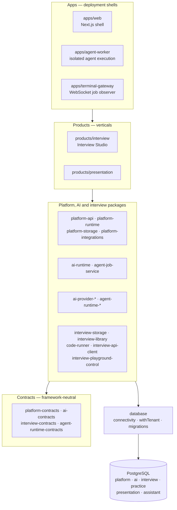

# Architecture overview — start here

Omnitech Studio is a **modular monolith**: one Next.js shell serves every
product same-origin, products are vertical slices registered at build time,
and shared behaviour lives in small packages with one public entrypoint each.
Two processes sit beside the shell — the **agent worker**, the only place a
coding agent runs, and the **terminal gateway**, which streams job events to a
browser terminal. Everything persists in **one PostgreSQL cluster** with a
schema per owner and forced row-level security.

Read this page first, then follow its links: the decisions are ADRs, the
deeper current-state pages are under `research/concepts/`, and the
machine-derived maps (module graph, API surface) are under `arch/`.

## Layers

Dependencies point down only. Each layer may use the layers below it, never
the ones above.

`interview-cli` sits outside the graph: a thin automation surface that bundles
`interview-api-client` and `interview-playground-control` and talks to the
running studio over HTTP, so agents never learn routes or credentials.

## Package boundaries

The rules are decided in [[adrs/ADR-0003-keep-package-boundaries-narrow-with-one-public-ent]]
and [[adrs/ADR-0004-build-products-as-verticals-inside-a-modular-monol]], and
**enforced on every `pnpm verify`** by `scripts/package-boundaries.test.ts`:

- A package declares exactly the workspace packages it imports — nothing
  undeclared, nothing unused — and no library package goes unimported.
- Imports go through the target's `exports` map; no deep or cross-root paths.
- Nothing imports an app; packages never import products; a product never
  imports another product.
- Contract packages depend only on contracts; adapters depend only on
  contracts; `database` depends on no workspace package.
- Only `apps/agent-worker` depends on an agent runtime.

| Package | Owns | Depends on (workspace) |
| --- | --- | --- |
| **Apps** | | |
| `apps/web` | Next.js delivery, root layout, auth entrypoints, tenant resolution, navigation, composition of products and API routers | products, platform-*, ai-*, agent-job-service, agent-runtime-contracts, database, code-runner |
| `apps/agent-worker` | Claiming agent jobs and running Codex / Claude Code in isolation | agent-job-service, agent-runtime-*, database, platform-storage |
| `apps/terminal-gateway` | Relaying a job's normalized events to a browser terminal over WebSocket | — |
| **Products** | | |
| `products/interview` | Interview Studio: manifest, frontend, Hono backend, domain services, `interview`/`practice` schemas | contracts, database, platform-storage, interview packages |
| `products/presentation` | Presentation product and its `presentation` schema | ai-contracts, platform-contracts, database, platform-storage |
| **Platform** | | |
| `platform-contracts` | Stable platform and product contracts (manifests, context) | — |
| `platform-runtime` | Trusted product registration and route resolution | platform-contracts |
| `platform-api` | Platform HTTP contracts, without Next.js | platform-contracts |
| `platform-storage` | `platform` and `ai` schemas, platform repositories, agent-job persistence, token encryption | database, platform-contracts, agent-job-service, agent-runtime-contracts |
| `platform-integrations` | OAuth protocol behaviour, no UI or database | — |
| `database` | PostgreSQL connectivity, `withTenant()` / `tenantTransaction`, migration execution, the single Drizzle migration stream | — |
| **AI** | | |
| `ai-contracts` | Provider-neutral execution, model, image and event contracts | — |
| `ai-runtime` | `AiExecutionGateway`: profile resolution, authorization, adapter delegation | ai-contracts |
| `ai-provider-openai` · `-anthropic` · `-images` | One provider SDK each, translated to the contracts | ai-contracts |
| `agent-runtime-contracts` | Agent job, profile and event contracts | ai-contracts |
| `agent-runtime-codex` · `-claude` | Codex and Claude Agent SDK translation | agent-runtime-contracts |
| `agent-job-service` | The durable agent-job lifecycle | agent-runtime-contracts |
| **Interview** | | |
| `interview-contracts` | Answer, guide and briefing schemas, language routing, answer workflows | — |
| `interview-storage` | Persistence interfaces and adapters | interview-contracts |
| `interview-library` | Library content, sections and search | interview-contracts |
| `code-runner` | Isolated Docker execution of solutions and tests | interview-contracts |
| `interview-api-client` | Typed HTTP client hiding paths, headers and responses | interview-contracts |
| `interview-playground-control` | Live Playground `get` / `set` / `reset` client | — |
| `interview-cli` | The `interview-answers` CLI (bundles the two clients) | — (bundled) |

## How a request flows

1. The browser asks for `/t/:tenantSlug/p/:productId/*`.
2. `apps/web` authenticates the user, resolves tenant membership, and finds
   the installed product through `platform-runtime`. No membership or no
   installation is a 404 before any domain code runs
   ([[adrs/ADR-0004-build-products-as-verticals-inside-a-modular-monol]]).
3. The product's Hono router, mounted by the shell, calls its domain services.
4. Services read and write through `withTenant()` or `tenantTransaction`,
   which set the tenant for the transaction; forced row-level security makes
   PostgreSQL refuse any row outside it
   ([[adrs/ADR-0005-isolate-tenants-in-one-postgresql-cluster-with-own]]).

## How AI work flows

- **Direct model calls** (answers, briefings, structured output, images): the
  product asks `AiExecutionGateway` for a stable profile; `ai-runtime`
  resolves the profile to a configured target and delegates to one
  `ai-provider-*` adapter. Product code never names a provider or model.
- **Agent jobs** (Codex, Claude Code): the shell creates, inspects, cancels and
  resumes jobs through `agent-job-service`; `platform-storage` persists them;
  `apps/agent-worker` claims a job and runs it through an `agent-runtime-*`
  adapter; the terminal gateway relays its events. Next.js never launches an
  agent process
  ([[adrs/ADR-0007-route-ai-work-through-aiexecutiongateway-profiles]]).
- Prompts, questions, generated content and model responses are never logged
  by default.

## Who owns which data

| Schema | Owner | Notes |
| --- | --- | --- |
| `platform` | `platform-storage` | Tenants, users, memberships, login identities, auth sessions, connected accounts, product installations, artifacts, audit events, preferences |
| `ai` | `platform-storage` | Agent jobs, sessions, events, payloads and artifacts; model definitions, profiles, provider configurations, tenant policies, usage records |
| `interview`, `practice` | `products/interview` | Companies, people, candidacies, interviews, plans, candidate profiles, concept briefs, briefings, rehearsals, answer drafts and revisions; exercises and attempts |
| `presentation` | `products/presentation` | Documents, presentations, slides, themes, generated images, exports, recordings, shares, generation sessions |
| `assistant` | the vendored interview assistant | Shipped with its own migrations; `database` runs them first |

Every tenant-owned row carries `tenant_id`, foreign keys between tenant rows
are composite on `(tenant_id, id)`, and row-level security is forced on every
table. Detail: [[research/concepts/interview-domain-model]].

## Where to go next

- Platform shell, product lifecycle, identity, failure behaviour, local
  operations: [[research/concepts/platform-architecture]].
- Interview tables, tenancy, `withTenant()`, migrations:
  [[research/concepts/interview-domain-model]].
- Choosing an AI execution boundary: [[research/references/ai-execution-boundaries]].
- Adding a product: [[research/references/adding-a-product]].
- Interview Studio surfaces: [[research/references/interview-studio]].
- Every decision: [[adrs/index]]; the rule that governs all of them:
  [[adrs/ADR-0002-simplicity-first-the-least-complex-design-that-mee]].
