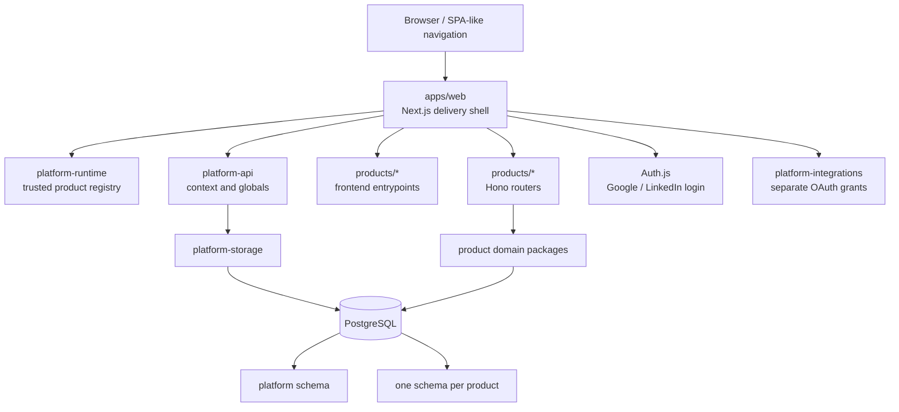

# Omnitech product platform architecture

Current-state overview of the platform: a modular monolith with build-time
product registration, a same-origin Next.js shell, embedded Hono product
backends, and one PostgreSQL cluster with schema ownership. The decisions
behind it are recorded in:

- [[adrs/ADR-0004-build-products-as-verticals-inside-a-modular-monol]] — shell vs product verticals, registration, routing, extraction criteria.
- [[adrs/ADR-0005-isolate-tenants-in-one-postgresql-cluster-with-own]] — tenancy and storage.
- [[adrs/ADR-0006-keep-login-identities-separate-from-connected-prov]] — identity vs connected accounts.
- [[adrs/ADR-0003-keep-package-boundaries-narrow-with-one-public-ent]] — package ownership.
- [[adrs/ADR-0002-simplicity-first-the-least-complex-design-that-mee]] — why the monolith is the default.

Tenant transactions and migration execution live in the `database` package
(`withTenant()`, `tenantTransaction`, one Drizzle stream in
`packages/database/drizzle`).

## Shape

The design follows maintenance ideas visible in
[Grafana](https://github.com/grafana/grafana) (a cohesive shell, stable
extension contracts, explicit registration, capability-oriented boundaries),
build-graph discipline from [Turborepo](https://github.com/vercel/turborepo),
typed full-stack package boundaries common in
[Cal.com](https://github.com/calcom/cal.com), and schema-owned service modules
used by many modular-monolith systems.

## Ownership

| Boundary | Owns | Must not own |
|---|---|---|
| `apps/web` | Next.js routes, root layout, Auth.js entrypoints, tenant shell, registry composition, router mounting | Product rules, product persistence, provider protocol details |
| `products/<id>` | Manifest, frontend pages, Hono router, domain services, product tests | Global auth, tenant shell, another product's internals |
| `platform-contracts` | Versioned Zod schemas and public TypeScript contracts | Runtime registration or I/O |
| `platform-runtime` | Trusted registration, collision detection, route resolution | Tenant persistence or React presentation |
| `platform-api` | Framework-neutral platform HTTP surface | Next.js request APIs |
| `database` | PostgreSQL connectivity, `withTenant()`, table convention helpers, migration execution | Domain schemas or repositories |
| `platform-storage` | The `platform` and `ai` schemas, platform repositories, token encryption | UI or OAuth protocol |
| `platform-integrations` | Provider endpoints, signed state, code exchange, normalized grants | Session resolution or database writes |

## Product lifecycle

1. A product package exports a versioned manifest, frontend loaders, and a Hono
   backend router.
2. The shell explicitly registers the trusted package at build time.
3. A tenant installation enables the product and supplies name, description,
   route labels, visibility, ordering, feature flags, and settings.
4. `/t/:tenantSlug/p/:productId/*` resolves membership, installation,
   permission, manifest route, and loader, in that order.
5. The shell retains global navigation, theme, locale, user, tenant, and
   connection state while product routes change client-side.

Product installation is data-driven; executable product code is not downloaded
from untrusted runtime locations. See [[research/references/adding-a-product]]
for the steps to add one.

## Data ownership

The `platform` schema owns users, login identities, sessions, tenants,
memberships, user preferences, product installations, connected accounts,
artifact metadata, and audit events. Each product owns its payload and
product-specific indexes in its own schema. Cross-product discovery uses
`platform.artifacts`; product payloads remain opaque references.

Every tenant-owned query includes `tenant_id`. The `database` package sets
`app.tenant_id` transaction-locally — `withTenant()` for Drizzle handles (also
setting `app.actor_id`), and `tenantTransaction` on the platform database for
raw `pg` clients — so PostgreSQL row-level security provides a second isolation
boundary. Pool-wide session mutation is forbidden. The interview product's tables, policies and
helpers are described in [[research/concepts/interview-domain-model]].

## Identity and connected accounts

Connected accounts run a separate authorization flow with:

- a separate OAuth client;
- HMAC-signed, expiring state bound to provider, user, and tenant;
- callback membership revalidation;
- AES-256-GCM encrypted access and refresh tokens;
- explicit scopes and expiry metadata;
- no client-side token exposure.

LinkedIn connection data requires LinkedIn product approval and corresponding
scopes. The base integration requests OIDC profile data only; connection
features stay disabled until approval is confirmed.

## Failure behavior

- Duplicate products or routes fail during application composition.
- Missing or disabled installations return 404 without loading product code.
- Missing permissions return 404 to avoid disclosing installed capabilities.
- `DATABASE_URL` is required; without it the app fails at its first database
  call.
- OAuth configuration failures return 503 before redirect. Invalid, expired, or
  cross-tenant callback state is rejected.
- Product frontend chunks use route-level loading states; one product does not
  control the global shell.

## Local operations

`pnpm dev` starts PostgreSQL with Docker Compose (`compose.yaml`, port 54320),
applies migrations (`pnpm --filter @omnitech/database db:migrate`) and seeds the
local owner and tenant (`pnpm --filter @omnitech/platform-storage
db:bootstrap`). Two roles keep a compromised app from changing its own
security (ADR-0005): `omnitech_owner` owns the database and schemas and runs the
migrations (`DATABASE_OWNER_URL`), while the app connects as `omnitech`, which
has data-manipulation grants only, is neither a superuser nor exempt from
row-level security, and cannot disable it, drop a policy or run DDL. `pnpm dev`
runs an idempotent step that creates the roles and grants on an existing volume
without touching data; the container's administrator is `postgres`. Tests start a throwaway container from the same
image for each test file, so Docker is the only database dependency.

Schemas are declared with Drizzle in the package that owns them and migrated by
one Drizzle stream in `packages/database/drizzle`. After changing a schema
file, run `pnpm --filter @omnitech/database db:generate` and commit the
migration.

Use `PLATFORM_BOOTSTRAP_EMAIL`, `PLATFORM_BOOTSTRAP_TENANT`, and
`PLATFORM_BOOTSTRAP_TENANT_NAME` to customize the initial owner and tenant.
Provider secrets are documented in `.env.example`.

## Extraction

Products stay embedded until one of the extraction criteria in
[[adrs/ADR-0004-build-products-as-verticals-inside-a-modular-monol]] is
measured. When one is met, retain the manifest and domain contracts, move the
Hono router behind an HTTP adapter, and decide separately whether the frontend
needs Multi-Zones or another deployment mechanism. Avoid remote module
execution.
