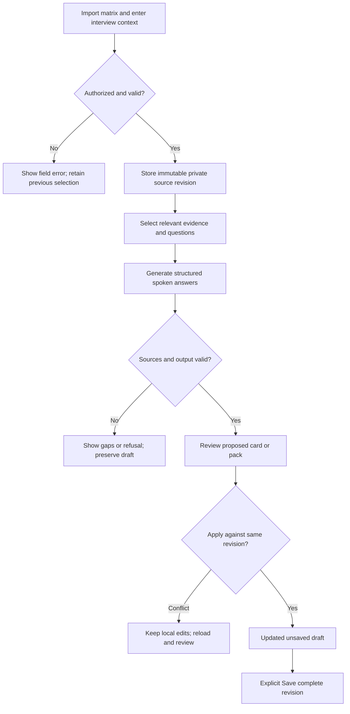

# Non-technical interview briefings

Status: implementation plan; no application changes made. Audited 2026-10-01 on `feat/omni-assistant-integration` at `1e8984a`. Initial working tree was clean. This document records the design decisions for this task.

## Outcome and completion checklist

Extend the Interview product with evidence-backed, spoken preparation for recruiter screens, motivation, career history, leadership, collaboration, prioritization, and practical employment questions. Use the existing Briefing presentation and the newer assistant's reviewed draft lifecycle. Preserve coding answers and technical explanations.

- Import and explicitly select an experience matrix; inspect the parsed sources before use.
- Add company, role, job description, interview stage, and optional recruiter/research notes.
- Answer one supplied question or generate an editable preparation pack.
- Produce concise natural-language answers, appropriate mini-STAR stories, exactly three talking points per answer, supporting evidence, and missing-information prompts. Non-technical answers require no code, language selection, complexity analysis, or runner.
- Reuse stage-aware evidence selection from document studio: relevance before recency, concrete company/system/action/outcome, and metrics only where supported.
- Preserve context, every question, edits, source revisions, and provenance through Save and reload.
- Support both existing delivery hosts through product-owned contracts/services. Keep tenant and actor boundaries explicit.
- Verify technical regressions, evidence rejection, save conflicts, and the complete user flow before calling the feature complete.

Non-goals: live-call transcription/listening, automated company research, document export, scoring/mock interviews, new services, embeddings infrastructure, or changes to document studio. Pasted research is input data, not instructions or verified employer information. This plan does not validate the attachment's claims about Zensurance, compensation, personnel, or interview policy.

## Audited work context

Paths in this section are relative to this repository unless prefixed with `docx:`; that prefix means `/Users/desoleary/dev/omnitech-solutions/docx-generator-studio/`.

| Concern | State | Evidence and implication |
| --- | --- | --- |
| Briefing UI | EXISTS | `products/interview/src/frontend/studio-shell.tsx:20` names Briefing; `concept-lab.tsx:199` calls `/explain`; `concept-markdown-content.tsx:38` splits question headings into Collapse items. Reuse visual conventions. |
| Personal grounding | PARTIAL | `products/interview/src/backend/services.ts:151` prohibits invented experience, but `:155` defaults to another checkout's absolute matrix path and `:161` swallows read failures. Replace implicit profile loading for the new mode. |
| Non-technical output | PARTIAL | `services.ts:94` recognizes behavioural questions, while `:117` requires code for every answer and `:182` normalizes code examples. A dedicated output contract and validator are required. |
| Existing explanation storage | PARTIAL | `packages/interview-contracts/src/schemas.ts:36` accepts free-form context but saves only title/topic/Markdown at `:47`; `concept-lab.tsx:227` saves the latest answer, not the whole follow-up collection. Do not use that format for prep packs. |
| Reviewed assistant drafts | EXISTS, coding-shaped | `products/interview/src/backend/assistant/workspace.ts:41` embeds the coding schema; `:62` defines scoped evidence; `:139` scopes SQL by tenant/actor/product. `assistant/prompt.ts:13` separates Propose, Apply and Save. Extend this lifecycle. |
| Source integrity | EXISTS, limited | `assistant/evidence.ts:29` checks authorization/hash; `:72` checks claims, quotes and typed metrics. Its own comment says this is not natural-language entailment verification. Preserve that limitation visibly. |
| Source ingestion | PARTIAL | `apps/api/src/main.ts:359` ingests attachments as candidate evidence, without typed matrix parsing. Employer notes must not inherit candidate-evidence status. |
| Two hosts | EXISTS | `apps/frontend/src/main.tsx:53` mounts assistant-bound Workspace. `apps/web/src/platform/api.ts:58` mounts the legacy Interview API; it does not mount the same assistant host. Do not assume host parity. |
| Durable private storage | EXISTS | `packages/platform-storage/migrations/0004_assistant_interview.sql:1` creates drafts, immutable saved revisions and evidence with tenant/actor/product RLS. Extend product storage, not global profile files. |
| Product registration | EXISTS | `products/interview/src/manifest.tsx:6` defines `omnitech.interview`, routes and read/write permissions. No new product registration is needed. The local assistant uses product ID `interview` (`apps/api/src/main.ts:317`); preserve host-specific identity mapping rather than silently renaming stored scope. |

### What document studio actually establishes

- `docx:server/workflows/interview-prep.workflow.ts:11` defines stage adaptation, strongest-match selection and non-invention rules. `:276` defines retrieval from the job description; `:294` onward generates pitch, fit areas, proof points, likely questions, best stories and questions to ask.
- `docx:server/prompts/interview-prep-generator/interview-prep-generator-ai-prompt.md:7` requires concrete evidence and spoken tone; its reasoning steps select 2–4 relevant roles. Carry these semantics forward.
- Its flat string fields are a document-template contract. Use structured answer cards here; do not copy numbered DOCX replacement fields or require exactly five matches when the evidence supports fewer.
- Retrieval is not proven operational by those definitions. `docx:server/services/langgraph/graphService.ts:61` creates the client without a retrieval provider; `docx:server/workflows/studio-graph-factory.ts:36` supplies disabled retrieval. `docx:packages/langgraph-engine/src/internal/builtins/rag-retrieve.ts:83` returns fallback context when no provider exists. This is a source inspection finding, not a runtime test or a claim that a gate was tested.
- Python JSON parsing and SHA-256 comparison found that the Desktop attachment and `docx:server/data/profiles/my-experience-matrix.json` are byte-identical: 50,122 bytes; SHA-256 `fb4eb564c4649a970c749479a8febe22712ceb1f8643a08ed8476605fdd62293`. The supplied matrix has 15 roles, 8 story-selector entries, 5 leadership signals and 9 repositories. These are dataset facts, not independently verified career claims.
- The matrix includes qualified/text metrics such as `4M+`, `90% to 99%`, and `weeks to hours`. Never convert these into invented precise scalar improvements. Dates such as “Present” are source assertions, not proof of current employment.

## Chosen design and simplicity gate

| Option | Estimated changed lines including tests | Additional operational components | Decision |
| --- | --- | --- | --- |
| Extend Interview contracts, product services/UI and existing PostgreSQL storage | 1,500–2,500 | 0 | Choose; covers imports, evidence, complete saved packs and both hosts. |
| Extract a cross-app candidate-profile package | 2,500–4,000 | 0 | No demonstrated shared runtime consumer for this task; defer. |
| Separate retrieval/generation service with embeddings | 4,000+ | At least one service and index lifecycle | No demonstrated isolation or scale requirement; reject. |

These are planning estimates, not measured delivery times. This scope exceeds the repository's 1,000-line checkpoint: review this plan before starting implementation. Planning is the authorized work in this task.

Keep one product-owned non-technical briefing service. Inject existing host authorization, database and AI execution capabilities. No new provider SDK, model-name branching, LangGraph workflow, background worker, or package. Document studio's selection and stage rules belong in a versioned product prompt and deterministic source selection, not a copied orchestration engine.

## User experience

1. In Briefing, choose **Technical explanation** or **Interview preparation**. The assistant-host Workspace exposes the same preparation view and shared components; an explicit choice wins over question classification.
2. Import JSON through a file picker or paste JSON. Preview candidate identity, roles, source issues and available stories; confirm import and select the profile. Show the filename/version, never a server filesystem path. Reimport creates a new immutable version; existing saved packs retain their original version.
3. Enter company, role, stage (recruiter, hiring manager, leadership, behavioural/final), optional job description, and notes. Separate supplied employer information from candidate preferences: salary expectations, location, availability, and reason for moving are user inputs, never inferred from career evidence.
4. Choose **Answer question** or **Prepare interview**. For a pack, present an editable suggested question list before generation: introduction, motivation/company fit, role scope, mentoring, project story, Product collaboration, prioritization, next-role goals, logistics, and questions to ask. Label these as suggested questions, not predictions of the actual interview.
5. Each answer card contains the direct spoken answer, a relevant story where useful, exactly three follow-up talking points, expandable source quotations and a visible missing-information state. Keep 30–60-second answers by default and up to 90 seconds for substantive stories; avoid forced STAR for motivation or compensation.
6. Allow selection of a different supporting story and refinement of one card. Generation/refinement proposes a change; Apply changes the draft; Save creates a durable revision. User typing edits the draft without claiming evidence verification. Display dirty and evidence-review states.
7. Save the complete pack, not just the last question. On navigation with unsaved changes, offer Save/Discard/Stay. Concurrent draft or source changes return a conflict and preserve local edits; no silent last-write-wins. Changing company, stage or selected profile marks affected answers stale rather than rewriting them.

The sample use case should yield a short opening pitch, relevant leadership/delivery stories, credible motivation talking points, honest gaps, logistics placeholders, and company-specific questions based on supplied notes. It must not invent a salary preference, interviewer biography, prior incident or leadership disagreement.

## Contracts and storage

Implement Zod schemas and exported inferred types in `packages/interview-contracts`; keep all limits explicit. Proposed contracts:

```ts
type BriefingContext = {
  company: string;
  role: string;
  stage: "recruiter" | "hiring-manager" | "leadership" | "behavioural";
  jobDescription?: string;
  employerNotes?: string;
  candidatePreferences?: string;
  profile: { id: string; revision: number };
};
type BriefingQuestion = {
  id: string;
  question: string;
  category: "background" | "motivation" | "leadership" | "delivery"
    | "collaboration" | "logistics" | "questions-to-ask";
  answerMarkdown: string;
  talkingPoints: [string, string, string];
  evidenceRefs: Array<{ id: string; revision: number; sha256: string }>;
  gaps: string[];
};
type BriefingDraft = {
  kind: "non-technical-briefing";
  title: string;
  context: BriefingContext;
  questions: BriefingQuestion[];
};
```

Add typed field-level claims keyed by question ID and answer/talking-point field; do not reuse coding field names or fabricate a TypeScript language value. Extend the draft/patch boundary with a discriminated briefing variant while retaining the existing coding payload unchanged. Old records parse as coding drafts; new saves include an explicit kind. Reject cross-kind patches and code execution on briefing artifacts.

Import accepts the supplied matrix shape (candidate, roles, mappings, signals, story selector, taxonomy, repository evidence and extensions). Require candidate and roles; validate known nested fields, preserve optional source sections and unknown extension data without treating them as instructions. Proposed limits: 1 MiB UTF-8 JSON, 100 roles, 200 repositories, 20 questions per pack; reject excess explicitly, never silently truncate. Convert into bounded evidence fragments to respect the existing 100,000-character evidence limit.

Store private profile metadata and immutable JSON versions in new `interview.candidate_profiles` / `interview.candidate_profile_revisions` tables. Keys include tenant, actor, product, profile ID and revision. Store normalized fragments in existing evidence storage with JSON-pointer locators and source hashes. No personal matrix fixture in Git; tests use synthetic equivalents. Keep profile rows separate from the public Knowledge library.

Extend evidence kinds with employer-context and candidate-preference. Candidate achievements require candidate evidence; employer claims require employer-context and remain labelled “supplied, unverified”; preferences require explicit candidate-preference input. Version those records too. Extend SQL checks and claim validation additively. Import ordinary scalar metrics deterministically; preserve ranges, lower bounds and qualitative changes as verbatim metric text with source references. Ambiguous values require review and cannot be rephrased as exact numbers. Do not allow the model to mint trusted metrics.

Repository surface: `importProfile(scope, input)`, `listProfiles(scope)`, `getProfileRevision(scope, ref)`, with immutable revisions and an expected-revision requirement on updates. Use existing workspace read/edit/propose/apply/save operations for briefing drafts. Do not create a second draft store.

## Retrieval, generation and review

Build a small deterministic selector over the imported matrix. Rank matches lexicographically by direct requested skill/system match, domain match, then adjacent evidence; add leadership/theme/story-selector matches for non-technical questions. Use stable source order as a tie-breaker, not automatic recency preference. Select 2–4 relevant roles when available; expose fewer with gaps when not. Resolve selector company names against actual role records. Repositories support project claims, not employment or personal outcome claims by implication.

Supply selected fragments, stage, role context and question to the host's existing AI boundary. Keep trusted instructions separate from all uploaded/pasted data. Disable tools for source text; uploads cannot select tools, providers, paths, permissions, or system prompts. Reuse current model configuration and existing execution budgets; do not change retries/concurrency/timeouts for this feature.

Validate structured output before proposing: schema, question IDs, three talking points, permitted source kind, exact quotations, source revision/hash, and supported metric representation. Generated answer text is editable material, never new evidence. Claims checks establish integrity and consistency, not comprehensive truth; show “source linked” rather than “verified true.” Unsupported questions produce gaps and a request for the missing fact. Entirely invalid/provider-failed output leaves the previous draft intact and produces a safe error.



## API, hosts and authorization

Product Hono router owns profile import/list/read and preparation request validation. Add typed client methods to `interview-api-client`; CLI and Playground control consume those public contracts. Proposed routes under the host's Interview API mount: `POST /profiles/import`, `GET /profiles`, `GET /profiles/:id/revisions/:revision`, and `POST /workspaces/:workspace/artifacts/:artifact/briefing-proposals`. Proposal input contains expected draft revision, context and either explicit question IDs or the confirmed suggested list; response contains proposal ID, base revision and validated draft preview/gaps. Reuse existing Apply/Save routes.

Order every operation: authenticated session → tenant membership → installed/enabled Interview product → read/write permission → actor ownership/audience → source and artifact revision → domain work. IDs supplied by clients never establish scope. Use 400 for invalid input, 401/403 for access failures, non-enumerating 404 for inaccessible IDs, 409 for conflicts, 413 for size and 503 for provider unavailability.

Extract only the reusable Interview host wiring needed by both `apps/api` and `apps/web`; leave framework session resolution and local fixture identity in their hosts. The local host remains explicitly local; do not promote its fixed actor checks to production authentication. Next.js injects platform context/database/AI gateway. Assistant-host generation uses its existing executor and reviewed proposal path. Both call the same briefing schemas, selection, prompt and validation logic. Do not route new private data through the legacy same-origin/token-only `/explain` path.

Manifest, frontend loader, global navigation and installation schema remain unchanged: this is an Interview workspace mode. Theme, user, tenant and permissions stay shell-owned. Selected profile, role/stage, draft, selected story and UI expansion state are product-local; sensitive content is server-persisted, not global localStorage. No new OAuth or connected-account grants. Imports are file bytes, not arbitrary local paths or fetched URLs. Isolation: a briefing error does not prevent coding or existing saved material from loading.

## Reviewable implementation milestones

1. **Contracts and compatibility.** Add briefing/profile/source schemas, discriminated draft decoding and claims fields. Tests prove old coding payloads still round-trip, cross-kind patches fail, and code runners reject briefing artifacts. No UI rollout yet.
2. **Private import and persistence.** Add additive migration, repository methods, typed API client and product import routes; connect host authorization. Test synthetic matrix variants, qualified metrics, malformed/oversized input, cross-actor/tenant access and immutable reimport. Display explicit import preview/confirmation.
3. **Evidence-backed generation.** Add deterministic selector, stage-aware prompt, proposal validation and shared host integration. Test missing stories, untrusted instructions, incorrect quotes/hashes, forbidden sources and unsupported metrics using fake model responses. Test one-card refinement preserves every untouched card and context field.
4. **Briefing UI and complete saving.** Add preparation mode to both hosts, shared context/profile controls, editable question list, source drawer, gaps, reviewed proposals and full-pack Save/reload. Keep technical views and existing historical explanations intact.
5. **Automation and release verification.** Extend CLI/Playground control and `.rulesync` router/concept instructions with explicit non-technical mode; regenerate compatibility files. Route interview preparation before ambiguous DSA language fallback. Preserve direct answer behaviour; do not introduce mock-interview mode. Complete cross-host checks and operator runbook.

One verified unit per commit; no push is authorized by this planning request. Do not edit vendored assistant tarballs: adapt through their public exports; if those exports cannot support the briefing variant, stop at a concrete compatibility finding rather than silently changing the vendor API.

## Verification and release operations

Use package commands already defined in this checkout:

```sh
pnpm --filter @omnitech/interview-contracts test
pnpm --filter @omnitech/product-interview test
pnpm rulesync:generate
pnpm rulesync:verify
pnpm verify
```

Add repository tests to the package that owns each new adapter. Integration commands must state PostgreSQL/browser prerequisites and use isolated synthetic data, not the operator's private profile or live provider. No Docker runner needed for non-technical answers; existing coding runner integration remains a separate explicit environment-dependent check. Capture and inspect test/build artifacts; do not label an unexecuted command passed.

For each new rejection gate, deliberately corrupt the exact fixture or response the check consumes; demonstrate the expected failing assertion, restore and reread it, then demonstrate success. Include broken citation, inflated metric, wrong actor, stale draft and missing-code technical-example cases. Do not infer gate strength from a green happy path.

Acceptance walkthrough, in each host: import a synthetic matrix matching the supplied shape → enter recruiter-stage role context → answer introduction and mentoring → generate the confirmed pack → change a story → Apply → edit logistics → Save → reload all cards/context/provenance. Simulate provider failure and a second-tab conflict; confirm draft preservation. Repeat a technical explanation and runnable coding answer to prove their contracts are unchanged. Browser validation must check actual card rendering, no forced code controls, and navigation with dirty content.

Migration is additive and explicit. Register it in platform migration discovery and the local host's explicit migration list (`apps/api/src/main.ts:95`). Rollback disables new-mode routing in code and preserves new rows; never drop imported evidence or saved packs. Old code cannot necessarily parse new draft variants: isolate new briefing artifacts from old coding listings and document this compatibility boundary before release. Credentials, deployment settings and running processes do not change.

Log request/run IDs, error categories, prompt/schema versions, source counts and normalized usage only. Do not log profile content, question text, recruiter notes, generated answers or raw model payloads. Runbook must cover import rejection, missing/removed source access, provider configuration failure, conflict recovery and rollback to technical-only UI. Source revocation must continue to deny derived artifact access through existing authorization checks.

## Not done in this planning task

No implementation, database migration, model call, browser session, test suite, build, live retrieval validation, commit or push was performed. Source inspection and JSON/hash comparison support this plan; runtime behaviour remains to be verified during implementation. Document studio was read only. The supplied private matrix was not copied into the repository.


## Implementation follow-through

Implemented in the separate `feat/non-technical-briefings` managed worktree after approval. The operator subsequently requested their supplied matrix as the local default; it is held in ignored local data and seeded into private scoped profiles. See `2026-10-01-non-technical-briefings-runbook.md` for final behavior and routes, and `2026-10-01-non-technical-briefings-verification.md` for executed checks, corrections, deviations and unverified boundaries.
