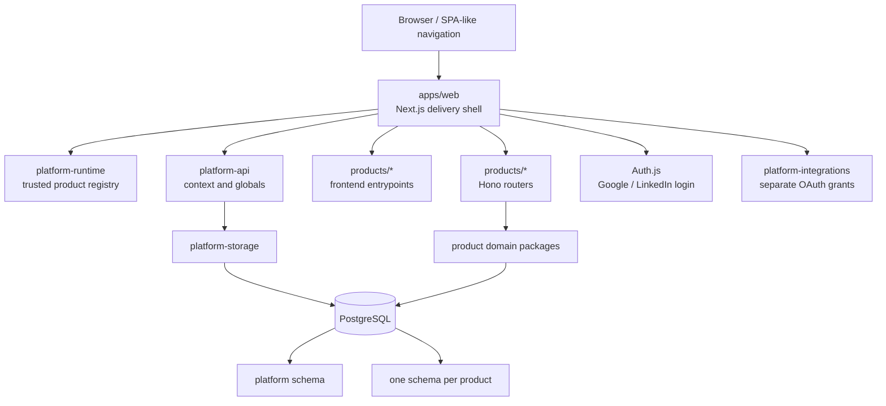

# Omnitech product platform

## Chosen architecture

Omnitech uses a modular monolith with build-time product registration, a
same-origin Next.js shell, embedded Hono product backends, and one PostgreSQL
cluster with schema ownership. This gives each product a complete vertical
boundary without introducing remote frontend loading, cross-service
transactions, or multiple deployments before the team has a demonstrated need.



The design follows the same core maintenance ideas visible in
[Grafana](https://github.com/grafana/grafana): a cohesive shell, stable extension
contracts, explicit registration, and capability-oriented boundaries. It also
borrows build graph discipline from
[Turborepo](https://github.com/vercel/turborepo), typed full-stack package
boundaries common in [Cal.com](https://github.com/calcom/cal.com), and
schema-owned service modules used by many modular-monolith systems.

## Ownership

| Boundary | Owns | Must not own |
|---|---|---|
| `apps/web` | Next.js routes, root layout, Auth.js entrypoints, tenant shell, registry composition, router mounting | Product rules, product persistence, provider protocol details |
| `products/<id>` | Manifest, frontend pages, Hono router, domain services, product tests | Global auth, tenant shell, another product's internals |
| `platform-contracts` | Versioned Zod schemas and public TypeScript contracts | Runtime registration or I/O |
| `platform-runtime` | Trusted registration, collision detection, route resolution | Tenant persistence or React presentation |
| `platform-api` | Framework-neutral platform HTTP surface | Next.js request APIs |
| `platform-storage` | Pool lifecycle, transactions, migrations, tenant RLS context, repositories, token encryption | UI or OAuth protocol |
| `platform-integrations` | Provider endpoints, signed state, code exchange, normalized grants | Session resolution or database writes |

## Product lifecycle

1. A product package exports a versioned manifest, frontend loaders, and Hono
   backend router.
2. The shell explicitly registers the trusted package at build time.
3. A tenant installation enables the product and supplies name, description,
   route labels, visibility, ordering, feature flags, and settings.
4. `/t/:tenantSlug/p/:productId/*` resolves membership, installation,
   permission, manifest route, and loader in that order.
5. The shell retains global navigation, theme, locale, user, tenant, and
   connection state while product routes change client-side.

Product installation is data-driven; executable product code is not downloaded
from untrusted runtime locations. Independent product deployments remain
possible later by replacing a loader or router adapter without changing the
manifest or tenant installation contract.

## Data ownership

The `platform` schema owns users, login identities, sessions, tenants,
memberships, user preferences, product installations, connected accounts,
artifact metadata, and audit events. Each product owns its payload and
product-specific indexes in its own schema. Cross-product discovery uses
`platform.artifacts`; product payloads remain opaque references.

Every tenant-owned query includes `tenant_id`. `tenantTransaction` sets
`app.tenant_id` transaction-locally so PostgreSQL row-level security provides a
second isolation boundary. Pool-wide session mutation is forbidden.

## Identity and connected accounts

Login providers establish identity. Their grants are not reused for product
actions. Connected accounts run a separate authorization flow with:

- a separate OAuth client;
- HMAC-signed, expiring state bound to provider, user, and tenant;
- callback membership revalidation;
- AES-256-GCM encrypted access and refresh tokens;
- explicit scopes and expiry metadata;
- no client-side token exposure.

LinkedIn connection data requires LinkedIn product approval and corresponding
scopes. The base integration requests OIDC profile data only; connection
features must remain disabled until approval is confirmed.

## Failure behavior

- Duplicate products or routes fail during application composition.
- Missing or disabled installations return 404 without loading product code.
- Missing permissions return 404 to avoid disclosing installed capabilities.
- Database configuration is mandatory for deployed persistence. A deterministic
  `local` context is available only when `DATABASE_URL` is absent.
- OAuth configuration failures return 503 before redirect. Invalid, expired, or
  cross-tenant callback state is rejected.
- Product frontend chunks use route-level loading states; one product does not
  control the global shell.

## Local operations

```bash
docker compose up -d postgres
pnpm --filter @omnitech/platform-storage db:migrate
pnpm --filter @omnitech/platform-storage db:bootstrap
pnpm dev
```

Use `PLATFORM_BOOTSTRAP_EMAIL`, `PLATFORM_BOOTSTRAP_TENANT`, and
`PLATFORM_BOOTSTRAP_TENANT_NAME` to customize the initial owner and tenant.
Provider secrets are documented in `.env.example`.

## Extraction criteria

Keep products embedded until one of these is measured:

- independent release ownership;
- materially different scaling characteristics;
- regulatory or network isolation;
- fault containment that cannot be achieved in-process;
- a runtime or language requirement incompatible with the shell.

When a criterion is met, retain the manifest and domain contracts, move the Hono
router behind an HTTP adapter, and decide separately whether the frontend needs
Multi-Zones or another deployment mechanism. Avoid remote module execution.
